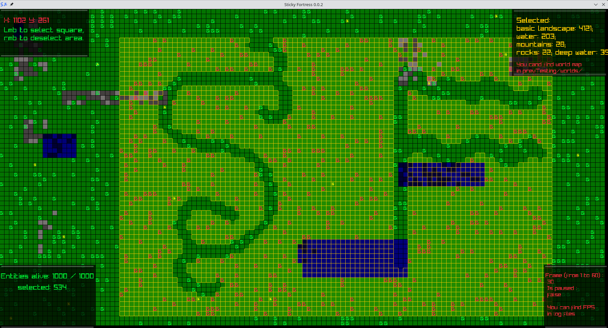

# Sticky Fortress

## Description

> Clone of dwarf fortress on C with using Raylib. Right now in prototype stage.  

At this time, you can't manage entities - they'll move, find food and die without your control. You can just select cells, watch for entities' stats and set pause with `space` button. Press `Lmb` to start square selecting, move mouse to end square position and press `Lmb` again. For start new square selecting just click at any cell. For deselect a specific cell click `Rmb`.  



## Installation & running (Linux)

1) Clone this git repository:
    ```sh
    git clone https://github.com/fedor-pro/Sticky_Fortress.git
    ```

2) Install raylib following these instructions:
    ```
    https://github.com/raysan5/raylib/wiki/Working-on-GNU-Linux
    ```

3) Navigate to the project directory:
    ```sh
    cd Sticky_Fortress/prevTesting
    ```

4) Clean all compile results if they are with using `make`
    ```sh
    make clean
    ```

4) Build & run project using `make`
    ```sh
    make run
    ```
    or:
    ```sh
    make crun
    ```

## Common errors

1) Programm compilation crashed with `Makefile` error `src/run/draw.o: in function «drawGuiPannel»: draw.c:(.text+0x1e): undefined reference to DrawRectangle'` or similar: check that you have Linux and Raylib downloaded